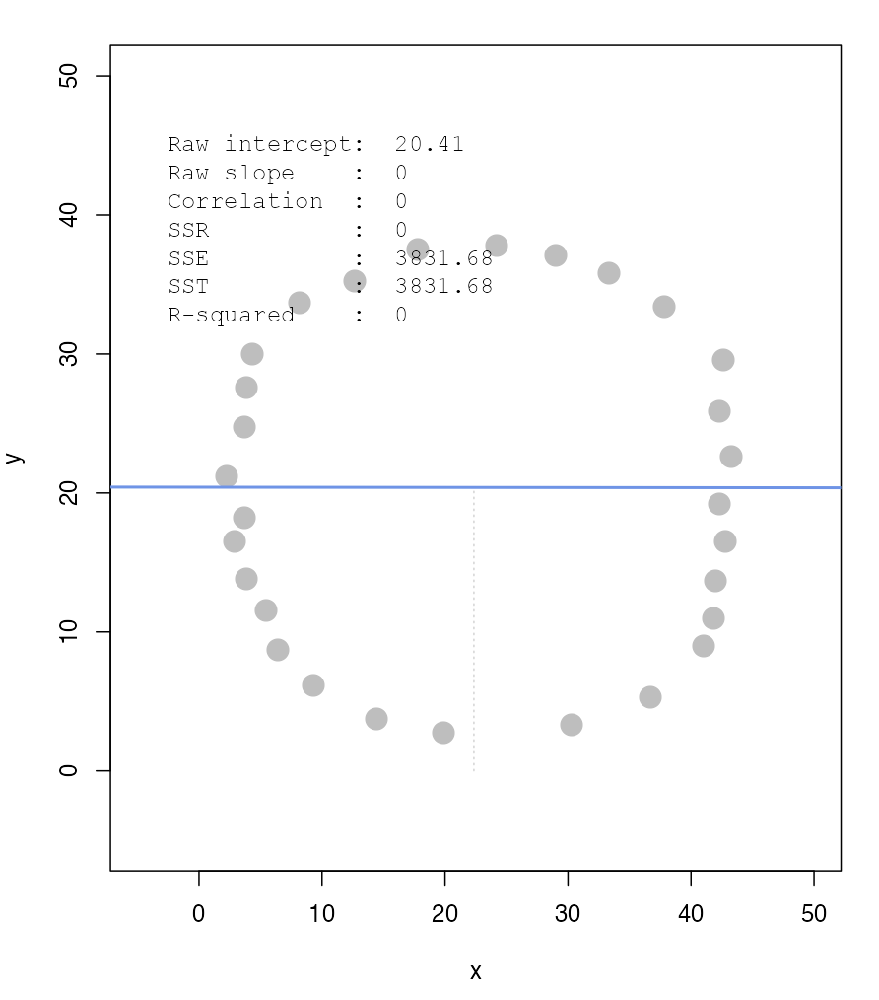
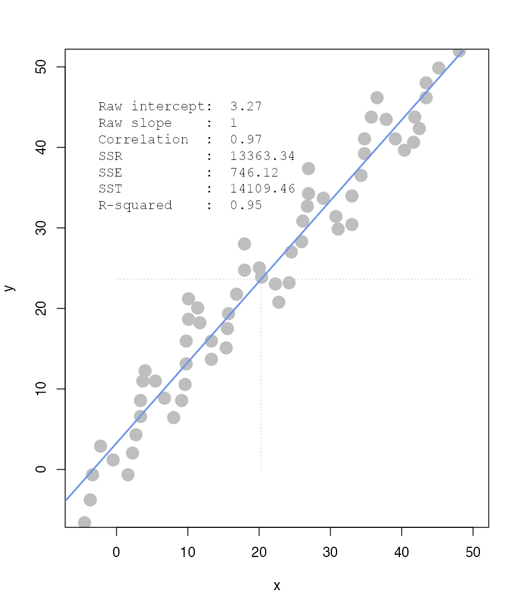

---
output:
  pdf_document:
    latex_engine: xelatex
header-includes:
  # Packages
  - '\usepackage{fancyhdr}'
  - '\usepackage{float}'
  - '\usepackage{etoolbox}'
  - '\usepackage{framed}'
  - '\usepackage[most]{tcolorbox}'
  # Page style
  - '\pagestyle{fancy}'
  - '\fancyhf{}'
  - '\fancyhead[R]{ID: 114078510}'
  - '\fancyfoot[R]{\footnotesize\thepage}'
  - '\renewcommand{\headrulewidth}{0pt}'
  - '\setlength{\leftmargini}{1.5em}'
  - '\setlength{\leftmarginii}{1.5em}'
  # Section and spacing
  - '\makeatletter'
  - '\renewcommand{\section}{\@startsection{section}{1}{\z@}{0.1\baselineskip}{0.1\baselineskip}{\normalfont\Large\bfseries}}'
  - '\preto{\@verbatim}{\topsep=0pt \partopsep=0pt \parskip=0pt \parsep=0pt}'
  - '\AtBeginEnvironment{itemize}{\setlength{\itemsep}{0pt}\setlength{\parskip}{0pt}\setlength{\topsep}{0pt}}'
  - '\makeatother'
  # Custom boxes/environments
  - '\newtcolorbox{remarkbox}{colback=yellow!6,colframe=orange!55!yellow,arc=1.5mm,boxrule=0.4pt,left=4pt,right=4pt,top=2pt,bottom=1pt}'
  - '\newtcolorbox{recallbox}{colback=gray!6,colframe=black!60,arc=1.5mm,boxrule=0.4pt,left=4pt,right=4pt,top=2pt,bottom=1pt}'
  - '\setlength{\OuterFrameSep}{1.5pt}'
  - '\makeatletter'
  - '\@ifundefined{Shaded}{\newenvironment{Shaded}{\begin{snugshade}}{\end{snugshade}\vspace{-0.2\baselineskip}}}{\renewenvironment{Shaded}{\begin{snugshade}}{\end{snugshade}\vspace{-0.2\baselineskip}}}'
  - '\makeatother'
---

# CSDS 2026 -- HW 8
\begin{remarkbox}
\footnotesize\textit{\textbf{Remark:} Using AI to improve the grammar of written answers.}
\end{remarkbox}

\medskip

### Initialization
```{r setup}
set.seed(20260419)
library(ggplot2)

knitr::opts_chunk$set(
  echo = TRUE,
  warning = FALSE,
  message = FALSE,
  fig.pos = "H",
  fig.align = "center",
  fig.show = "hold",
  dev.args = list(pointsize = 9)
)
```

\begingroup\color{gray!45}\noindent\rule{\linewidth}{0.3pt}\par\endgroup

## Question 1
Let’s make an automated recommendation system for the PicCollage mobile app.

```{r load_data}
library(data.table)
ac_bundles_dt <- fread("piccollage_accounts_bundles.csv")
ac_bundles_matrix <- as.matrix(ac_bundles_dt[, -1, with = FALSE])
```

### (a) Let’s explore to see if any sticker bundles seem intuitively similar:
i. **Download PicCollage onto your mobile from the App Store and take a look at the style and content of various bundles in their Sticker Store**
    \par
    \medskip
    I think PicCollage sticker bundles can roughly be grouped into five categories:
    1. **Theme-based bundles**: A theme-based bundle reflects a visual idea or concept, such as *Y2K*, *ocean*, or *spring*.
    2. **Style-based bundles**: These are defined by how the stickers look rather than what they depict, such as *glitter*, *gradient*, or *pastel*. 
    3. **Holiday-based bundles**: These are created for specific occasions, such as *Valentine’s Day*, *Easter*, *Graduation*, and *Birthday*.
    4. **Use-based bundles**:These are designed for particular activities or creative purposes, such as *journal* or *scrapbook*.
    5. **Object-based bundles**: These are centered on specific items or motifs, such as *bows*, *fruits*, *flowers*, or *hearts*.

ii. **Find a single sticker bundle that is both in our limited data set and also in the app’s Sticker Store. Then, use your intuition to recommend (guess!) five other bundles in our dataset that might have similar usage patterns as this bundle.**
    \par
    \medskip
    Taking the `WherezSanta` as example, I think five bundles in the dataset that might have similar usage patterns are:
    1. `WinterWonderland`
    2. `snowflakes`
    3. `Xmas2012StickerPack `
    4. `christmassnow`
    5. `xmassketches`

### (b) Let’s find similar bundles using geometric models of similarity:
i. **Let’s create cosine-similarity based recommendations for a given bundle:**
    1. Create a `cosine_sim(a, b)` function that returns the cosine similarity of two vectors.
        ```{r q1b_i1}
        cosine_sim <- function(a, b) {
          dot_product <- sum(a * b, na.rm = TRUE)
          magnitude_a <- sqrt(sum(a^2, na.rm = TRUE))
          magnitude_b <- sqrt(sum(b^2, na.rm = TRUE))

          if (magnitude_a == 0 || magnitude_b == 0) {
            return(0)
          }

          return(dot_product / (magnitude_a * magnitude_b))
        }
        ```
    \medskip
    2. Create a `cosine_recos(items_matrix, item_name)` function that returns 5 recommendations for that item based on cosine similarity.
        ```{r q1b_i2}
        cosine_recos <- function(items_matrix, item_name) {
          # extract column vector for item_name from matrix
          item_vector <- items_matrix[, item_name]

          # apply cosine_sim on all columns versus item_vector
          sims <- apply(items_matrix, 2, function(col) cosine_sim(item_vector, col))

          # item names of the sorted cosine similarity values
          top_names <- names(sort(sims, decreasing = TRUE))

          # return the names of the top five similar items (exclude the item itself)
          top_names <- top_names[top_names != item_name]
          return(top_names[1:5])
        }
        ```
    \medskip
    3. What are the top 5 recommendations for the bundle you chose to explore earlier?
        ```{r q1b_i3}
        cosine_recos(ac_bundles_matrix, "WherezSanta")
        ```

ii. **Let’s create *correlation* based recommendations:**
    1. Reuse the `cosine_recos(…)` function you created above but give it an items matrix where each item (column) has already been mean-centered in advance.
        ```{r q1b_ii1}
        items_matrix_centered <- apply(ac_bundles_matrix, 2, function(col) {
          col - mean(col, na.rm = TRUE)
        })
        ```
    \medskip
    2. What are the top 5 recommendations using correlations?
        ```{r q1b_ii2}
        cosine_recos(items_matrix_centered, "WherezSanta")
        ```
iii. **Let’s create *adjusted-cosine* based recommendations:**
      1. Reuse the `cosine_recos(…)` function you created above but give it an items matrix where each observation (row) has already been mean-centered in advance.
          ```{r q1b_iii1}
          items_matrix_row_centered <- t(apply(ac_bundles_matrix, 1, function(row) {
            row - mean(row, na.rm = TRUE)
          }))
          ```
      \medskip
      2. What are the top 5 recommendations using adjusted cosine?
          ```{r q1b_iii2}
          cosine_recos(items_matrix_row_centered, "WherezSanta")
          ```

### (c) (required, but not graded) Let’s reflect on these three variations of the cosine similarity: What is the conceptual difference in cosine similarity, correlation, and adjusted cosine?
- **Cosine Similarity** treats two items as similar when they show similar raw usage patterns across users, which is influenced by overall popularity and user-level biases.
- **Correlation** treats two items as similar when they vary in similar ways relative to their own average usage, emphasizing shared relative patterns rather than raw usage levels.
- **Adjusted Cosine** treats two items as similar when they vary in similar ways relative to their own average usage, emphasizing shared relative patterns rather than raw usage levels.

### (d) Let's apply the same cosine similarity idea to a very different dataset: the meaning of book descriptions as encoded in LLM embeddings.
i. **Pick a book that you are either familiar with or has an interesting description. Load the file *description_embeddings.rds* and use your `cosine_sim()` and `cosine_recos()` functions earlier to find the top 5 most similar books to a book of your choice.**
    ```{r q1d_i}
    books <- read.csv("best_books_ever.csv", stringsAsFactors = FALSE)
    description_embeddings <- readRDS("description_embeddings.rds")
    
    cosine_recos(description_embeddings, "Broken Universe")
    ```

ii. **Do the recommendations make sense? Why does cosine similarity “know” about similarity of book descriptions, without being told anything about plot or genre?**
    \par
    The recommendations partly make sense. For example, *The Walls of the Universe* and *The Adventures of Luther Arkwright* are strong matches because they also involve parallel universes and alternate worlds. Other recommendations are weaker, they may share some thematic elements, but they are not as closely related in terms of plot or genre.

    Cosine similarity does not actually understand book content; it only compares vectors. The reason it can reflect similarity in plots or genres is that those vectors were created by embedding models (like *Word2Vec* or *BERT*), which have already learned semantic patterns from large text data. As a result, descriptions with similar meanings end up pointing in similar directions, and cosine similarity simply measures that alignment.


## Question 2
Correlation is at the heart of many data analytic methods so let’s explore it further.
```{r q2_setup}
library(compstatslib)
```

For each of the scenarios below, create the described set of points in the simulation. You might have to create each scenario a few times to get a general sense of them. Visuals of the scenarios are shown on the next page.

### (a) Scenario A: Create a horizontal set of random points, with a relatively narrow but flat distribution.
i. **What raw slope of x and y would you generally expect?**
    \par
    The raw slope would be close to zero, since the points are horizontally distributed and do not show any upward or downward trend.

ii. **What is the correlation of x and y that you would generally expect?**
    \par
    The correlation of x and y would be close to zero, because there is no clear positive or negative linear relationship.

### (b) Scenario B: Create a random set of points to fill the entire plotting area, along both x-axis and y-axis
i. **What raw slope of x and y would you generally expect?**
    \par
    The raw slope would be close to zero, as the points are randomly distributed across the entire plotting area without any discernible trend.

ii. **What is the correlation of x and y that you would generally expect?**
    \par
    The correlation of x and y would be close to zero, because the points are randomly distributed and do not show any linear relationship.

### (c) Scenario C: Create a diagonal set of random points trending upwards at 45 degrees
i. **What raw slope of x and y would you generally expect?**
    \par
    The raw slope would be close to 1, since the points are trending upwards at a 45-degree angle, indicating a strong positive linear relationship.

ii. **What is the correlation of x and y that you would generally expect?**
    \par
    The correlation of x and y would be close to 1, because the points show a strong positive linear relationship as they trend upwards together.

### (d) Scenario D: Create a diagonal set of random trending downwards at 45 degrees
i. **What raw slope of x and y would you generally expect?**
    \par
    The raw slope would be close to -1, since the points are trending downwards at a 45-degree angle, indicating a strong negative linear relationship.

ii. **What is the correlation of x and y that you would generally expect?**
    \par
    The correlation of x and y would be close to -1, because the points show a strong negative linear relationship as they trend downwards together.

### (e) Apart from any of the above scenarios, find another pattern of data points with no correlation ($r \approx 0$).
\textit{\textbf{Note:} Can you create a pattern that visually suggests a strong relationship but produces $r \approx 0$?}

Another pattern of data points with no correlation could be a circular distribution, where the points are arranged in a circular pattern around the origin. 
\par
So in this case, there would be no linear relationship between x and y, resulting in a correlation close to zero.

```{r q2e, echo=FALSE, out.width='40%'}

```


### (f) Apart from any of the above scenarios, find another pattern of data points with perfect correlation ($r \approx 1$).
\textit{\textbf{Note:} Can you find a scenario where the pattern visually suggests a non-perfect relationship?}

Another pattern with a near-perfect correlation is a cloud of points that follows a strong upward linear trend but does not lie exactly on a straight line.
```{r q2f, echo=FALSE, out.width='40%'}

```

### (g) Let’s see how correlation relates to simple regression, by simulating any linear relationship you wish:
i. **Run the simulation and record the points you create: `pts <- interactive_regression()`**
    \textit{\textbf{Note:} Simulate either a positive or negative relationship}

    ```{r q2g_i}
    # pts <- interactive_regression()
    # write.table(pts, "pts.csv", row.names = FALSE, sep = ",")
    pts <- read.csv("pts.csv")
    ```

    I take the example from Q2(f), which simulates a strong positive relationship with noise.

ii. **Use the `lm()` function to estimate the regression intercept and slope of pts to ensure they are the same as the values reported in the simulation plot: `summary( lm( pts$y ~ pts$x ))`**
    ```{r q2g_ii}
    summary(lm(y ~ x, data = pts))
    ```
\newpage

iii. **Calculate the correlation of `x` and `y` using `cor(pts)` — is it the same as reported in the plot?**
      ```{r q2g_iii}
      cor(pts)
      ```

iv. **Now, *standardize* the values of both `x` and `y` from `pts` and re-estimate the regression slope**
    ```{r q2g_iv}
    pts_standardized <- as.data.frame(scale(pts))
    summary(lm(y ~ x, data = pts_standardized))
    ```

v. **What is the relationship between *correlation* and the *standardized simple-regression* estimates?**
    \par
    The standardized simple regression slope is equal to the correlation coefficient. This is because standardizing x and y removes the original units and rescales both variables to have mean 0 and standard deviation 1, so the regression slope no longer reflects unit changes and instead captures the same standardized linear relationship measured by correlation.